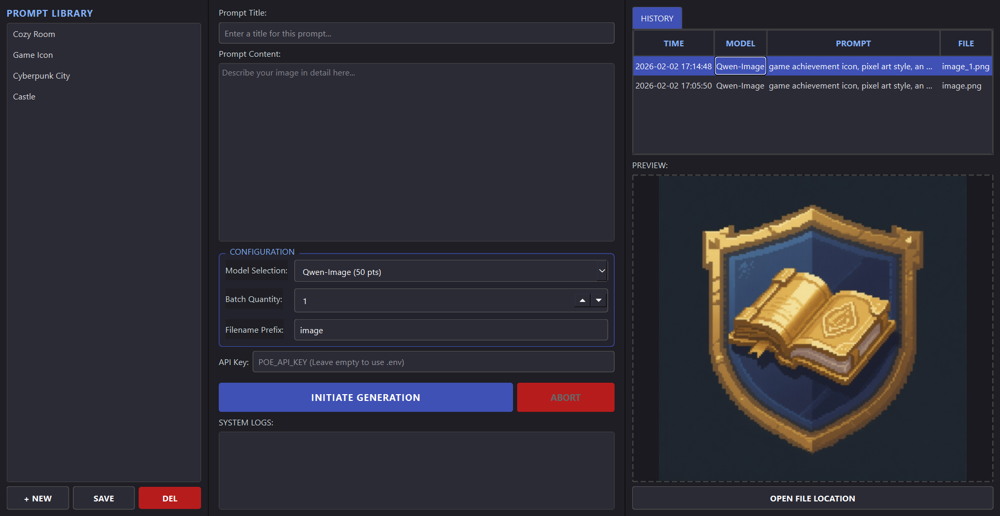

# 🎨 Poe Image Studio (Poe 图像生成工作室)

欢迎使用 **Poe Image Studio**！这是一个专门为 Poe 用户打造的桌面端生图工具简单来说，它能让你在电脑上通过 Poe 的 API 批量生成图片，并且把图片自动保存到本地，方便管理

不用再每次手动复制粘贴提示词了，也不用一张张保存图片了，一切自动化搞定！✨



---

## 🚀 它能做什么？

*   **多模型支持**：支持 Playground-v2.5, StableDiffusionXL, DALL-E-3, Nano-Banana-Pro 等多种模型
*   **批量生成**：一次想生 5 张、10 张？没问题，设置好数量，去喝杯咖啡，回来图就都在文件夹里了
*   **提示词管理**：内置“提示词库”，你可以保存常用的 Prompt（比如赛博朋克风、二次元风），下次直接点选使用
*   **本地保存**：生成的图片会自动按时间顺序保存在 `outputs` 文件夹里，不会弄丢
*   **历史记录**：所有生成过的图片都有记录，随时可以回看当时的提示词和模型
*   **实时预览**：生成完直接在软件里看大图

---

## 🛠️ 如何安装

如果你是第一次使用，请按照以下步骤操作（假设你已经安装了 Python）：

1.  **打开终端** (在当前文件夹下)
2.  **创建虚拟环境** (推荐，防止污染你的电脑环境)：
    ```bash
    python -m venv venv
    ```
3.  **激活环境**：
    *   Windows: `.\venv\Scripts\activate`
    *   Mac/Linux: `source venv/bin/activate`
4.  **安装依赖**：
    ```bash
    pip install -r requirements.txt
    ```

---

## 🎮 如何使用

### 1. 获取 API Key
你需要一个 Poe 的 API Key
*   去 [Poe 官网](https://poe.com/api_key) 拿你的 Key
*   在软件界面上直接填入，或者在项目目录下创建一个 `.env` 文件（参考 `.env.example`），填入：
    ```
    POE_API_KEY=你的Key在这里
    ```

### 2. 运行软件
在终端输入：
```bash
python gui.py
```
或者如果你用的是 Windows 并且配置好了环境，直接双击运行脚本也行（推荐用命令行看日志）

### 3. 开始生图
1.  **选择模型**：下拉框里选一个，比如 `Playground-v2.5`（便宜又好用）
2.  **输入提示词**：在左边的大框框里写你想画什么，比如 "A cute cat in space suit"
3.  **设置数量**：比如想试 3 张，就填 3
4.  **点击 Generate**：然后等待进度条跑完

---

## 💰 关于模型消耗 (积分)

Poe 的模型是按积分 (Compute Points) 收费的不同模型的消耗差异很大，具体消耗请以 Poe 官方实时显示为准

> **小贴士**：刚开始测试 Prompt 时，建议先使用消耗较低的模型（如 Playground 或 SDXL），效果满意后再使用高消耗模型（如 DALL-E-3），这样更省积分！😉

---

## 📁 文件夹说明
*   `gui.py`: 软件的主程序
*   `outputs/`: 生成的图片都在这里
*   `archive/`: 之前的旧图片归档
*   `prompts.json`: 你的提示词库数据

---

祝你玩得开心！如果有 bug，请随时反馈🎨
